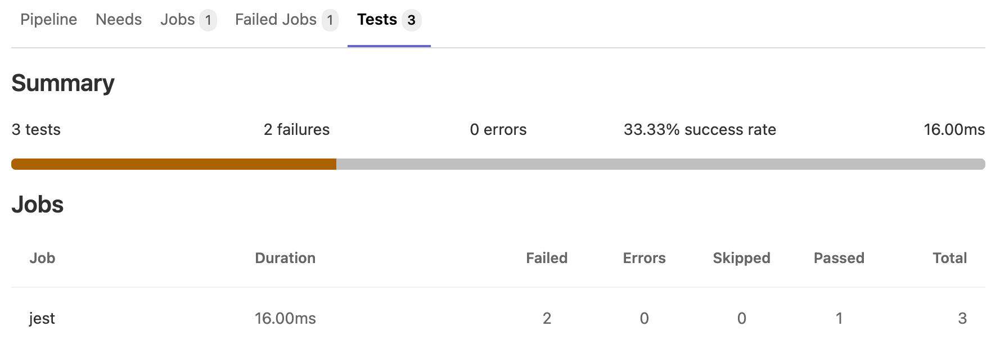
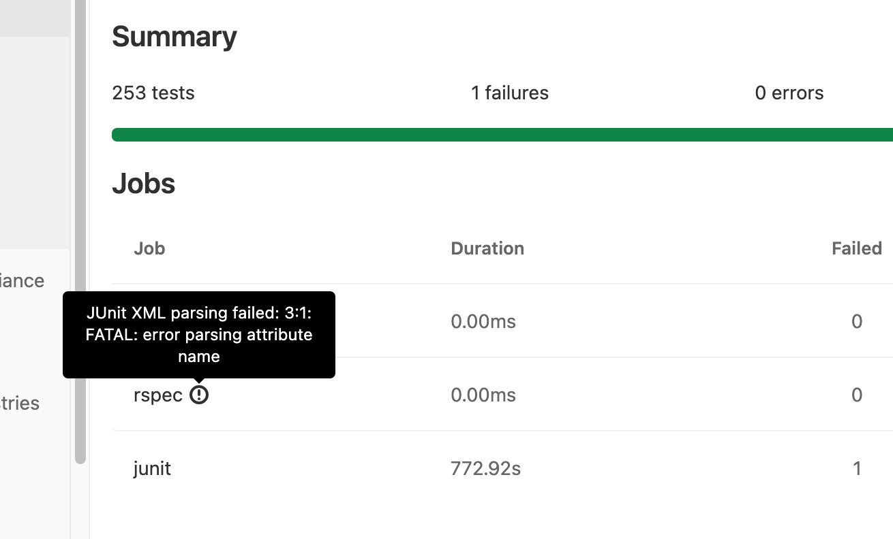

# Unit test reports **(FREE)**

> - [Introduced](https://gitlab.com/gitlab-org/gitlab-foss/-/issues/45318) in GitLab 11.2. Requires GitLab Runner 11.2 and above.
> - [Renamed](https://gitlab.com/gitlab-org/gitlab/-/merge_requests/39737) from JUnit test reports to Unit test reports in GitLab 13.4.

It is very common that a [CI/CD pipeline](pipelines/index.md) contains a
test job that verifies your code.
If the tests fail, the pipeline fails and users get notified. The person that
works on the merge request has to check the job logs and see where the
tests failed so that they can fix them.

You can configure your job to use Unit test reports, and GitLab displays a
report on the merge request so that it's easier and faster to identify the
failure without having to check the entire log. Unit test reports currently
only support test reports in the JUnit report format.

If you don't use Merge Requests but still want to see the unit test report
output without searching through job logs, the full
[Unit test reports](#viewing-unit-test-reports-on-gitlab) are available
in the pipeline detail view.

Consider the following workflow:

1. Your default branch is rock solid, your project is using GitLab CI/CD and
   your pipelines indicate that there isn't anything broken.
1. Someone from your team submits a merge request, a test fails and the pipeline
   gets the known red icon. To investigate more, you have to go through the job
   logs to figure out the cause of the failed test, which usually contain
   thousands of lines.
1. You configure the Unit test reports and immediately GitLab collects and
   exposes them in the merge request. No more searching in the job logs.
1. Your development and debugging workflow becomes easier, faster and efficient.

## How it works

First, GitLab Runner uploads all [JUnit report format XML files](https://www.ibm.com/docs/en/adfz/developer-for-zos/14.1.0?topic=formats-junit-xml-format)
as [artifacts](yaml/index.md#artifactsreportsjunit) to GitLab. Then, when you visit a merge request, GitLab starts
comparing the head and base branch's JUnit report format XML files, where:

- The base branch is the target branch (usually the default branch).
- The head branch is the source branch (the latest pipeline in each merge request).

The reports panel has a summary showing how many tests failed, how many had errors
and how many were fixed. If no comparison can be done because data for the base branch
is not available, the panel just shows the list of failed tests for head.

There are four types of results:

1. **Newly failed tests:** Test cases which passed on base branch and failed on head branch
1. **Newly encountered errors:** Test cases which passed on base branch and failed due to a
   test error on head branch
1. **Existing failures:**  Test cases which failed on base branch and failed on head branch
1. **Resolved failures:**  Test cases which failed on base branch and passed on head branch

Each entry in the panel shows the test name and its type from the list
above. Clicking on the test name opens a modal window with details of its
execution time and the error output.


### Number of recent failures

> - [Introduced](https://gitlab.com/gitlab-org/gitlab/-/issues/241759) in Merge Requests in GitLab 13.7.
> - [Feature flag removed](https://gitlab.com/gitlab-org/gitlab/-/issues/268249) in GitLab 13.8.
> - [Introduced](https://gitlab.com/gitlab-org/gitlab/-/issues/235525) in Test Reports in GitLab 13.9.

If a test failed in the project's default branch in the last 14 days, a message like
`Failed {n} time(s) in {default_branch} in the last 14 days` is displayed for that test.

## How to set it up

To enable the Unit test reports in merge requests, you need to add
[`artifacts:reports:junit`](yaml/index.md#artifactsreportsjunit)
in `.gitlab-ci.yml`, and specify the path(s) of the generated test reports.
The reports must be `.xml` files, otherwise [GitLab returns an Error 500](https://gitlab.com/gitlab-org/gitlab/-/issues/216575).

In the following examples, the job in the `test` stage runs and GitLab
collects the Unit test report from each job. After each job is executed, the
XML reports are stored in GitLab as artifacts and their results are shown in the
merge request widget.

To make the Unit test report output files browsable, include them with the
[`artifacts:paths`](yaml/index.md#artifactspaths) keyword as well, as shown in the [Ruby example](#ruby-example).
To upload the report even if the job fails (for example if the tests do not pass), use the [`artifacts:when:always`](yaml/index.md#artifactswhen)
keyword.

You cannot have multiple tests with the same name and class in your JUnit report format XML file.

### Ruby example

Use the following job in `.gitlab-ci.yml`. This includes the `artifacts:paths` keyword to provide a link to the Unit test report output file.

```yaml
## Use https://github.com/sj26/rspec_junit_formatter to generate a JUnit report format XML file with rspec
ruby:
  stage: test
  script:
    - bundle install
    - bundle exec rspec --format progress --format RspecJunitFormatter --out rspec.xml
  artifacts:
    when: always
    paths:
      - rspec.xml
    reports:
      junit: rspec.xml
```

### Go example

Use the following job in `.gitlab-ci.yml`:

```yaml
## Use https://github.com/gotestyourself/gotestsum to generate a JUnit report format XML file with go
golang:
  stage: test
  script:
    - go get gotest.tools/gotestsum
    - gotestsum --junitfile report.xml --format testname
  artifacts:
    when: always
    reports:
      junit: report.xml
```

### Java examples

There are a few tools that can produce JUnit report format XML file in Java.

#### Gradle

In the following example, `gradle` is used to generate the test reports.
If there are multiple test tasks defined, `gradle` generates multiple
directories under `build/test-results/`. In that case, you can leverage glob
matching by defining the following path: `build/test-results/test/**/TEST-*.xml`:

```yaml
java:
  stage: test
  script:
    - gradle test
  artifacts:
    when: always
    reports:
      junit: build/test-results/test/**/TEST-*.xml
```

In [GitLab Runner 13.0](https://gitlab.com/gitlab-org/gitlab-runner/-/issues/2620)
and later, you can use `**`.

#### Maven

For parsing [Surefire](https://maven.apache.org/surefire/maven-surefire-plugin/)
and [Failsafe](https://maven.apache.org/surefire/maven-failsafe-plugin/) test
reports, use the following job in `.gitlab-ci.yml`:

```yaml
java:
  stage: test
  script:
    - mvn verify
  artifacts:
    when: always
    reports:
      junit:
        - target/surefire-reports/TEST-*.xml
        - target/failsafe-reports/TEST-*.xml
```

### Python example

This example uses pytest with the `--junitxml=report.xml` flag to format the output
into the JUnit report XML format:

```yaml
pytest:
  stage: test
  script:
    - pytest --junitxml=report.xml
  artifacts:
    when: always
    reports:
      junit: report.xml
```

### C/C++ example

There are a few tools that can produce JUnit report format XML files in C/C++.

#### GoogleTest

In the following example, `gtest` is used to generate the test reports.
If there are multiple `gtest` executables created for different architectures (`x86`, `x64` or `arm`),
you are required to run each test providing a unique filename. The results
are then aggregated together.

```yaml
cpp:
  stage: test
  script:
    - gtest.exe --gtest_output="xml:report.xml"
  artifacts:
    when: always
    reports:
      junit: report.xml
```

#### CUnit

[CUnit](https://cunity.gitlab.io/cunit/) can be made to produce [JUnit report format XML files](https://cunity.gitlab.io/cunit/group__CI.html) automatically when run using its `CUnitCI.h` macros:

```yaml
cunit:
  stage: test
  script:
    - ./my-cunit-test
  artifacts:
    when: always
    reports:
      junit: ./my-cunit-test.xml
```

### .NET example

The [JunitXML.TestLogger](https://www.nuget.org/packages/JunitXml.TestLogger/) NuGet
package can generate test reports for .Net Framework and .Net Core applications. The following
example expects a solution in the root folder of the repository, with one or more
project files in sub-folders. One result file is produced per test project, and each file
is placed in a new artifacts folder. This example includes optional formatting arguments, which
improve the readability of test data in the test widget. A full .Net Core
[example is available](https://gitlab.com/Siphonophora/dot-net-cicd-test-logging-demo).

```yaml
## Source code and documentation are here: https://github.com/spekt/junit.testlogger/

Test:
  stage: test
  script:
    - 'dotnet test --test-adapter-path:. --logger:"junit;LogFilePath=..\artifacts\{assembly}-test-result.xml;MethodFormat=Class;FailureBodyFormat=Verbose"'
  artifacts:
    when: always
    paths:
      - ./**/*test-result.xml
    reports:
      junit:
        - ./**/*test-result.xml
```

### JavaScript example

There are a few tools that can produce JUnit report format XML files in JavaScript.

#### Jest

The [jest-junit](https://github.com/jest-community/jest-junit) npm package can generate test reports for JavaScript applications.
In the following `.gitlab-ci.yml` example, the `javascript` job uses Jest to generate the test reports:

```yaml
javascript:
  stage: test
  script:
    - 'jest --ci --reporters=default --reporters=jest-junit'
  artifacts:
    when: always
    reports:
      junit:
        - junit.xml
```

#### Karma

The [Karma-junit-reporter](https://github.com/karma-runner/karma-junit-reporter) npm package can generate test reports for JavaScript applications.
In the following `.gitlab-ci.yml` example, the `javascript` job uses Karma to generate the test reports:

```yaml
javascript:
  stage: test
  script:
    - karma start --reporters junit
  artifacts:
    when: always
    reports:
      junit:
        - junit.xml
```

#### Mocha

The [JUnit Reporter for Mocha](https://github.com/michaelleeallen/mocha-junit-reporter) NPM package can generate test reports for JavaScript
applications.
In the following `.gitlab-ci.yml` example, the `javascript` job uses Mocha to generate the test reports:

```yaml
javascript:
  stage: test
  script:
    - mocha --reporter mocha-junit-reporter --reporter-options mochaFile=junit.xml
  artifacts:
    when: always
    reports:
      junit:
        - junit.xml
```

### Flutter / Dart example

This example `.gitlab-ci.yml` file uses the [JUnit Report](https://pub.dev/packages/junitreport) package to convert the `flutter test` output into JUnit report XML format:

```yaml
test:
  stage: test
  script:
    - flutter test --machine | tojunit -o report.xml
  artifacts:
    when: always
    reports:
      junit:
        - report.xml
```

### PHP example

This example uses [PHPUnit](https://phpunit.de/) with the `--log-junit` flag.
You can also add this option using
[XML](https://phpunit.readthedocs.io/en/stable/configuration.html#the-junit-element)
in the `phpunit.xml` configuration file.

```yaml
phpunit:
  stage: test
  script:
    - composer install
    - vendor/bin/phpunit --log-junit report.xml
  artifacts:
    when: always
    reports:
      junit: report.xml
```

## Viewing Unit test reports on GitLab

> - [Introduced](https://gitlab.com/gitlab-org/gitlab/-/issues/24792) in GitLab 12.5 behind a feature flag (`junit_pipeline_view`), disabled by default.
> - [Feature flag removed](https://gitlab.com/gitlab-org/gitlab/-/issues/216478) in GitLab 13.3.

If JUnit report format XML files are generated and uploaded as part of a pipeline, these reports
can be viewed inside the pipelines details page. The **Tests** tab on this page
displays a list of test suites and cases reported from the XML file.



You can view all the known test suites and click on each of these to see further
details, including the cases that make up the suite.

You can also retrieve the reports via the [GitLab API](../api/pipelines.md#get-a-pipelines-test-report).

### Unit test reports parsing errors

> [Introduced](https://gitlab.com/gitlab-org/gitlab/-/issues/263457) in GitLab 13.10.

If parsing JUnit report XML results in an error, an indicator is shown next to the job name. Hovering over the icon shows the parser error in a tooltip. If multiple parsing errors come from [grouped jobs](jobs/index.md#group-jobs-in-a-pipeline), GitLab shows only the first error from the group.



NOTE:
GitLab.com has a 500,000 [test case parsing limit](../user/gitlab_com/#gitlab-cicd). Self-managed administrators can manage this setting on their instance.

GitLab does not parse very [large nodes](https://nokogiri.org/tutorials/parsing_an_html_xml_document.html#parse-options) of JUnit reports. There is [an issue](https://gitlab.com/gitlab-org/gitlab/-/issues/268035) open to make this optional.

## Viewing JUnit screenshots on GitLab

> - [Introduced](https://gitlab.com/gitlab-org/gitlab/-/issues/202114) in GitLab 13.0 behind the `:junit_pipeline_screenshots_view` feature flag, disabled by default.
> - [Feature flag removed](https://gitlab.com/gitlab-org/gitlab/-/issues/216979) in GitLab 13.12.

Upload your screenshots as [artifacts](yaml/index.md#artifactsreportsjunit) to GitLab. If JUnit
report format XML files contain an `attachment` tag, GitLab parses the attachment. Note that:

- The `attachment` tag **must** contain the relative path to `$CI_PROJECT_DIR` of the screenshots you uploaded. For
  example:

  ```xml
  <testcase time="1.00" name="Test">
    <system-out>[[ATTACHMENT|/path/to/some/file]]</system-out>
  </testcase>
  ```

- You should set the job that uploads the screenshot to
  [`artifacts:when: always`](yaml/index.md#artifactswhen) so that it still uploads a screenshot
  when a test fails.

A link to the test case attachment appears in the test case details in
[the pipeline test report](#viewing-unit-test-reports-on-gitlab).
