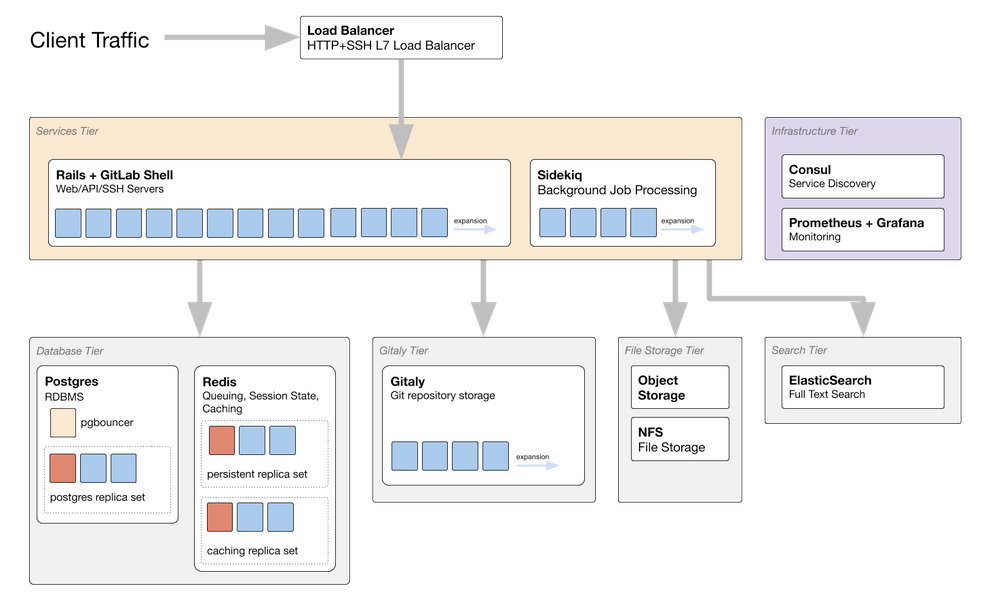
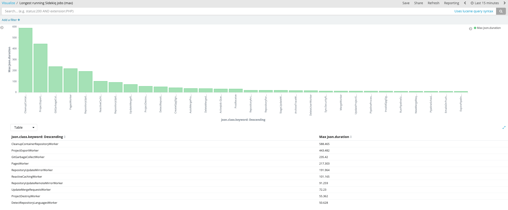

# GitLab scalability

This section describes the current architecture of GitLab as it relates to
scalability and reliability.

## Reference Architecture Overview

_[diagram source - GitLab employees only](https://docs.google.com/drawings/d/1RTGtuoUrE0bDT-9smoHbFruhEMI4Ys6uNrufe5IA-VI/edit)_

The diagram above shows a GitLab reference architecture scaled up for 50,000
users. We discuss each component below.

## Components

### PostgreSQL

The PostgreSQL database holds all metadata for projects, issues, merge
requests, users, and so on. The schema is managed by the Rails application
[db/structure.sql](https://gitlab.com/gitlab-org/gitlab/-/blob/master/db/structure.sql).

GitLab Web/API servers and Sidekiq nodes talk directly to the database by using a
Rails object relational model (ORM). Most SQL queries are accessed by using this
ORM, although some custom SQL is also written for performance or for
exploiting advanced PostgreSQL features (like recursive CTEs or LATERAL JOINs).

The application has a tight coupling to the database schema. When the
application starts, Rails queries the database schema, caching the tables and
column types for the data requested. Because of this schema cache, dropping a
column or table while the application is running can produce 500 errors to the
user. This is why we have a [process for dropping columns and other
no-downtime changes](avoiding_downtime_in_migrations.md).

#### Multi-tenancy

A single database is used to store all customer data. Each user can belong to
many groups or projects, and the access level (including guest, developer, or
maintainer) to groups and projects determines what users can see and
what they can access.

Users with the administrator role can access all projects and even impersonate
users.

#### Sharding and partitioning

The database is not divided up in any way; currently all data lives in
one database in many different tables. This works for simple
applications, but as the data set grows, it becomes more challenging to
maintain and support one database with tables with many rows.

There are two ways to deal with this:

- Partitioning. Locally split up tables data.
- Sharding. Distribute data across multiple databases.

Partitioning is a built-in PostgreSQL feature and requires minimal changes
in the application. However, it [requires PostgreSQL
11](https://www.2ndquadrant.com/en/blog/partitioning-evolution-postgresql-11/).

For example, a natural way to partition is to [partition tables by
dates](https://gitlab.com/groups/gitlab-org/-/epics/2023). For example,
the `events` and `audit_events` table are natural candidates for this
kind of partitioning.

Sharding is likely more difficult and requires significant changes
to the schema and application. For example, if we have to store projects
in many different databases, we immediately run into the question, "How
can we retrieve data across different projects?" One answer to this is
to abstract data access into API calls that abstract the database from
the application, but this is a significant amount of work.

There are solutions that may help abstract the sharding to some extent
from the application. For example, we want to look at [Citus
Data](https://www.citusdata.com/product/community) closely. Citus Data
provides a Rails plugin that adds a [tenant ID to ActiveRecord
models](https://www.citusdata.com/blog/2017/01/05/easily-scale-out-multi-tenant-apps/).

Sharding can also be done based on feature verticals. This is the
microservice approach to sharding, where each service represents a
bounded context and operates on its own service-specific database
cluster. In that model data wouldn't be distributed according to some
internal key (such as tenant IDs) but based on team and product
ownership. It shares a lot of challenges with traditional, data-oriented
sharding, however. For instance, joining data has to happen in the
application itself rather than on the query layer (although additional
layers like GraphQL might mitigate that) and it requires true
parallelism to run efficiently (that is, a scatter-gather model to collect,
then zip up data records), which is a challenge in itself in Ruby based
systems.

#### Database size

A recent [database checkup shows a breakdown of the table sizes on
GitLab.com](https://gitlab.com/gitlab-com/gl-infra/infrastructure/-/issues/8022#master-1022016101-8).
Since `merge_request_diff_files` contains over 1 TB of data, we want to
reduce/eliminate this table first. GitLab has support for [storing diffs in
object storage](../administration/merge_request_diffs.md), which we [want to do on
GitLab.com](https://gitlab.com/gitlab-com/gl-infra/infrastructure/-/issues/7356).

#### High availability

There are several strategies to provide high-availability and redundancy:

- Write-ahead logs (WAL) streamed to object storage (for example, S3, or Google Cloud
  Storage).
- Read-replicas (hot backups).
- Delayed replicas.

To restore a database from a point in time, a base backup needs to have
been taken prior to that incident. Once a database has restored from
that backup, the database can apply the WAL logs in order until the
database has reached the target time.

On GitLab.com, Consul and Patroni work together to coordinate failovers with
the read replicas. [Omnibus ships with Patroni](../administration/postgresql/replication_and_failover.md).

#### Load-balancing

GitLab EE has [application support for load balancing using read
replicas](../administration/database_load_balancing.md). This load balancer does
some actions that aren't traditionally available in standard load balancers. For
example, the application considers a replica only if its replication lag is low
(for example, WAL data behind by less than 100 MB).

More [details are in a blog
post](https://about.gitlab.com/blog/2017/10/02/scaling-the-gitlab-database/).

### PgBouncer

As PostgreSQL forks a backend process for each request, PostgreSQL has a
finite limit of connections that it can support, typically around 300 by
default. Without a connection pooler like PgBouncer, it's quite possible to
hit connection limits. Once the limits are reached, then GitLab generates
errors or slow down as it waits for a connection to be available.

#### High availability

PgBouncer is a single-threaded process. Under heavy traffic, PgBouncer can
saturate a single core, which can result in slower response times for
background job and/or Web requests. There are two ways to address this
limitation:

- Run multiple PgBouncer instances.
- Use a multi-threaded connection pooler (for example,
  [Odyssey](https://gitlab.com/gitlab-com/gl-infra/infrastructure/-/issues/7776).

On some Linux systems, it's possible to run [multiple PgBouncer instances on
the same port](https://gitlab.com/gitlab-org/omnibus-gitlab/-/issues/4796).

On GitLab.com, we run multiple PgBouncer instances on different ports to
avoid saturating a single core.

In addition, the PgBouncer instances that communicate with the primary
and secondaries are set up a bit differently:

- Multiple PgBouncer instances in different availability zones talk to the
  PostgreSQL primary.
- Multiple PgBouncer processes are colocated with PostgreSQL read replicas.

For replicas, colocating is advantageous because it reduces network hops
and hence latency. However, for the primary, colocating is
disadvantageous because PgBouncer would become a single point of failure
and cause errors. When a failover occurs, one of two things could
happen:

- The primary disappears from the network.
- The primary becomes a replica.

In the first case, if PgBouncer is colocated with the primary, database
connections would time out or fail to connect, and downtime would
occur. Having multiple PgBouncer instances in front of a load balancer
talking to the primary can mitigate this.

In the second case, existing connections to the newly-demoted replica
may execute a write query, which would fail. During a failover, it may
be advantageous to shut down the PgBouncer talking to the primary to
ensure no more traffic arrives for it. The alternative would be to make
the application aware of the failover event and terminate its
connections gracefully.

### Redis

There are three ways Redis is used in GitLab:

- Queues: Sidekiq jobs marshal jobs into JSON payloads.
- Persistent state: Session data and exclusive leases.
- Cache: Repository data (like Branch and tag names) and view partials.

For GitLab instances running at scale, splitting Redis usage into
separate Redis clusters helps for two reasons:

- Each has different persistence requirements.
- Load isolation.

For example, the cache instance can behave like an least-recently used
(LRU) cache by setting the `maxmemory` configuration option. That option
should not be set for the queues or persistent clusters because data
would be evicted from memory at random times. This would cause jobs to
be dropped on the floor, which would cause many problems (like merges
not running or builds not updating).

Sidekiq also polls its queues quite frequently, and this activity can
slow down other queries. For this reason, having a dedicated Redis
cluster for Sidekiq can help improve performance and reduce load on the
Redis process.

#### High availability/Risks

Single-core: Like PgBouncer, a single Redis process can only use one
core. It does not support multi-threading.

Dumb secondaries: Redis secondaries (also known as replicas) don't actually
handle any load. Unlike PostgreSQL secondaries, they don't even serve
read queries. They simply replicate data from the primary and take over
only when the primary fails.

### Redis Sentinels

[Redis Sentinel](https://redis.io/topics/sentinel) provides high
availability for Redis by watching the primary. If multiple Sentinels
detect that the primary has gone away, the Sentinels performs an
election to determine a new leader.

#### Failure Modes

No leader: A Redis cluster can get into a mode where there are no
primaries. For example, this can happen if Redis nodes are misconfigured
to follow the wrong node. Sometimes this requires forcing one node to
become a primary by using the [`REPLICAOF NO ONE`
command](https://redis.io/commands/replicaof).

### Sidekiq

Sidekiq is a multi-threaded, background job processing system used in
Ruby on Rails applications. In GitLab, Sidekiq performs the heavy
lifting of many activities, including:

- Updating merge requests after a push.
- Sending email messages.
- Updating user authorizations.
- Processing CI builds and pipelines.

The full list of jobs can be found in the
[`app/workers`](https://gitlab.com/gitlab-org/gitlab/-/tree/master/app/workers)
and
[`ee/app/workers`](https://gitlab.com/gitlab-org/gitlab/-/tree/master/ee/app/workers)
directories in the GitLab codebase.

#### Runaway Queues

As jobs are added to the Sidekiq queue, Sidekiq worker threads need to
pull these jobs from the queue and finish them at a rate faster than
they are added. When an imbalance occurs (for example, delays in the database
or slow jobs), Sidekiq queues can balloon and lead to runaway queues.

In recent months, many of these queues have ballooned due to delays in
PostgreSQL, PgBouncer, and Redis. For example, PgBouncer saturation can
cause jobs to wait a few seconds before obtaining a database connection,
which can cascade into a large slowdown. Optimizing these basic
interconnections comes first.

However, there are a number of strategies to ensure queues get drained
in a timely manner:

- Add more processing capacity. This can be done by spinning up more
  instances of Sidekiq or [Sidekiq Cluster](../administration/operations/extra_sidekiq_processes.md).
- Split jobs into smaller units of work. For example, `PostReceive`
  used to process each commit message in the push, but now it farms out
  this to `ProcessCommitWorker`.
- Redistribute/gerrymander Sidekiq processes by queue
  types. Long-running jobs (for example, relating to project import) can often
  squeeze out jobs that run fast (for example, delivering email). [This technique
  was used in to optimize our existing Sidekiq deployment](https://gitlab.com/gitlab-com/gl-infra/infrastructure/-/issues/7219#note_218019483).
- Optimize jobs. Eliminating unnecessary work, reducing network calls
  (including SQL and Gitaly), and optimizing processor time can yield significant
  benefits.

From the Sidekiq logs, it's possible to see which jobs run the most
frequently and/or take the longest. For example, these Kibana
visualizations show the jobs that consume the most total time:

_[visualization source - GitLab employees only](https://log.gitlab.net/goto/2c036582dfc3219eeaa49a76eab2564b)_

This shows the jobs that had the longest durations:

_[visualization source - GitLab employees only](https://log.gitlab.net/goto/494f6c8afb61d98c4ff264520d184416)_
